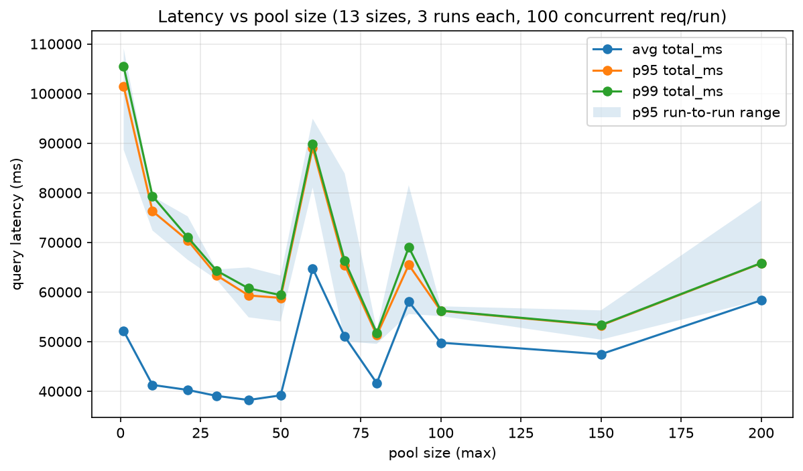
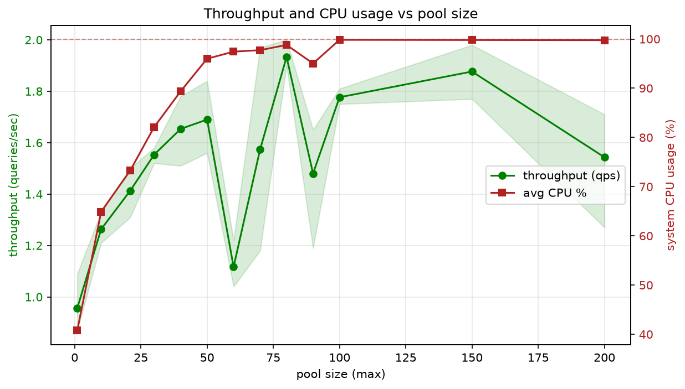
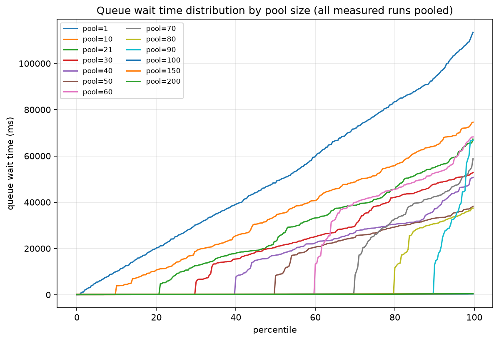
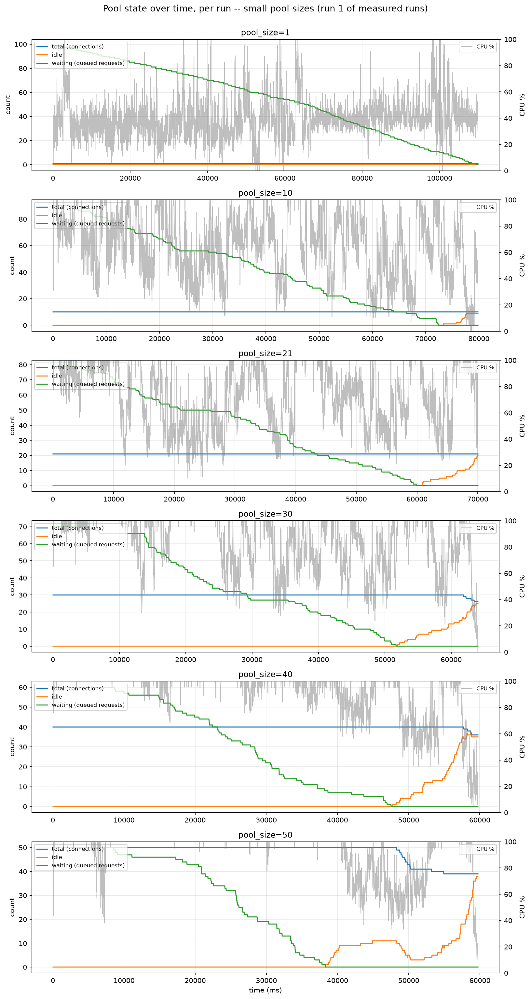
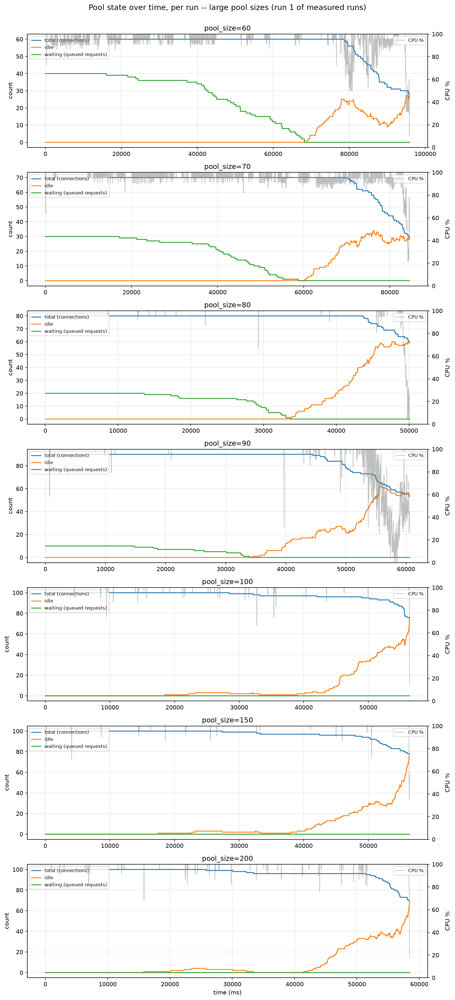

# Demystifying Postgres

In this experiment we're going to demystify Postgres behavior by hammering
a bulky 30 million row table with no indexes and seeing what actually
happens under real concurrent load. No pg_sleep, no guesswork just raw
seq scans, real CPU contention, and pool sizes fighting it out. we will see real production workloads

Should be fun to see what the numbers actually conclude.

## Disclaimer

These numbers came off my own machine 10 Mac cores, this RAM, this disk
speed, this OS scheduler, all of it baked in. Run this on a different
machine and you'll get different curves, maybe even a different "optimal"
pool size. Treat this as one data point showing the shape of the behavior,
not a universal number to copy into your own config.

- CPU: Apple M4
- Physical cores: 10
- Logical cores: 10
- RAM: 16 GB
- Disk: SSD
- macOS: 15.4.1
- Postgres: 18.0 (Postgres.app)

## What the hell am I actually trying to do

Basically everyone says "set your pool size to your core count" like it's
gospel, but nobody shows the actual behavior behind that advice. I want to
watch it happen throw real concurrent load at Postgres with zero indexes,
crank the pool size up from 1 to 200, and see with my own eyes where more
connections stop helping and start just getting in each other's way.

No pg_sleep faking it. Real CPU, real contention, real numbers.

## Setup

We spun up a `bench_data` table and dumped 30 million dummy rows into it
random category, random value, a chunky text payload. No index on anything
we'll actually query, on purpose. That's the whole point every query has
to do a real seq scan + aggregate, not a free index lookup.

Loaded it in 1M row batches into an UNLOGGED table just to make the _dumping_
fast doesn't affect how queries read the data later. Took about 55s,
landed at ~4GB on disk.

we will try it out for the connection pool of 1, 10, 21, 30, 40, 50, 60, 70, 80, 90, 100, 150, 200

# Here we go

No more talks, data data data will speak here we go

avg/p95/p99 latency across pool sizes, shaded band shows how noisy each size was across the 3 runs.

throughput on one axis, CPU% on the other watch where CPU flatlines near
100% while throughput stops climbing, that's the ceiling.

percentile curves per pool size, this is where you see requests actually sitting in line waiting for a free connection.

connections/idle/waiting + CPU% over the life of one run, smaller pools.

same thing, larger pools watch idle connections pile up once queueing disappears.

# Here is my conclusion

this is the flow for this workload and here's what i'll actually go with

so watching the numbers move as pool size goes up throughput and cpu usage climb together at first like you'd expect. more connections means more queries running at once which means more cores actually doing work instead of sitting idle. that's the honeymoon phase pool 1 to pool 50 every extra connection is buying you something real. cpu goes from 40% all the way up to 96% and throughput nearly doubles right alongside it.

by pool 50 cpu is basically pinned. there's no headroom left the machine is doing as much work as it physically can with 10 cores. and that's exactly where latency p95 hits its lowest point too. everything lines up cpu saturated latency floored throughput near its peak. that's the machine running flat out.

now here's the part that actually matters past pool 50 adding more connections doesn't help. it can't the cpu is already maxed there's no extra capacity to hand out. what actually happens is worse pool 60 90 and 200 all show throughput dropping below what pool 40 and 50 were already pulling off. that's not random bad luck that's contention. once you throw more concurrent connections at a cpu that's already full they don't get more work done they just spend more time getting scheduled switching context and stepping on each other. you're paying overhead for connections that have nowhere to actually run.

pool 80 and pool 150 do post slightly higher throughput numbers than pool 50 sure. but look at where they sit it's a flat noisy plateau with cpu already at 98 99% either way. those bumps aren't a trend they're noise on top of a system that's already saturated. there's no clean line saying bigger pool equals better anywhere past 50. it just flattens and wobbles.

so going with pool size 50. it's the smallest pool that gets cpu to its ceiling and latency to its floor at the same time which means it's squeezing basically everything out of this machine that there is to squeeze. going bigger doesn't buy real throughput it just means more open connections sitting idle most of the time waiting for a core that's already busy. that's wasted memory and wasted overhead for a workload that gets literally nothing back for it.

the actual takeaway here isn't that 50 is the magic number it's that the right pool size is wherever your cpu actually saturates for your specific query cost not some rule of thumb like cores times 2 or cores times 4. my queries are heavy full scans over 30 million unindexed rows so it took 40 to 50 concurrent connections before 10 cores were fully busy. a workload with cheap indexed lookups would saturate way earlier at a much smaller pool. the number only means something in the context of the work behind it.
